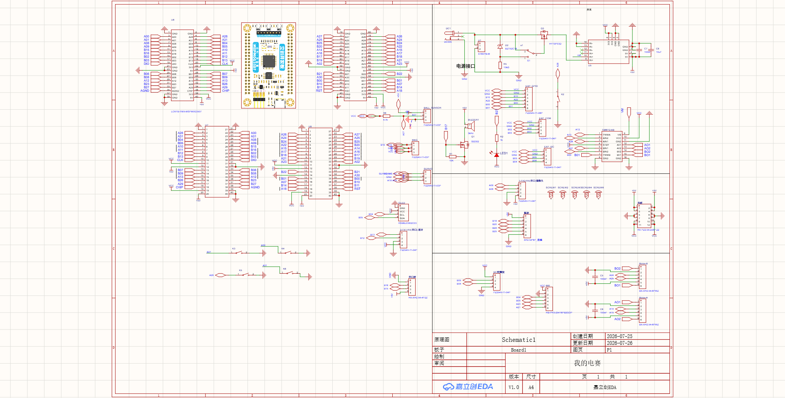

# 2026 数智中原电赛：视觉闭环与嵌入式控制

面向 2026“数智中原”河南省大学生电子设计竞赛的完整备赛工程。项目覆盖视觉感知、双 MCU 备选方案、串口协议、闭环步进电机控制、H 题钢球平衡控制、扩展板设计，以及从 host 测试到真实硬件联调的验证记录。

> 这不是只展示效果的 Demo。仓库保留了接口冻结、故障保护、可复现构建、实物接线和“已验证 / 待验证”边界，方便评审工程判断与系统集成能力。

## 系统架构

主线控制链路：

```text
MaixCAM2 视觉检测
        │ UART1（二进制协议）
        ▼
MSPM0G3507 天猛星
        │ UART3 + RS485
        ▼
X42S 闭环步进电机 ──► 云台 / 钢球平衡执行机构
```

备用验证链路采用 STM32F407 天空星，通过独立的标准外设库工程验证 MaixCAM ASCII 协议、OLED、按键、串口屏和 RS485 接口。

## 工程亮点

- **完整嵌入式链路**：MaixCAM2 视觉输出、MSPM0G3507/STM32F407 协议解析、状态机与执行器控制均有可追踪源码。
- **安全优先的运动控制**：云台自动运动默认锁定；丢目标、通信超时、软限位和显式解锁流程均在控制层实现。
- **可复现工程**：提供可直接打开的 Keil 工程、板级适配 overlay、生成脚本、环境配置说明和 host 逻辑测试。
- **软硬件协同**：冻结 UART/GPIO 分配，保留扩展板原理图快照、实物接线、方向标定和联调日志。
- **双路线容错**：MSPM0G3507 为主线，STM32F407 为备用验证平台，协议层和硬件层边界清晰。

## 验证状态

| 范围 | 当前结论 | 证据 |
| --- | --- | --- |
| Host 逻辑测试 | 通过 | 视觉帧、X42S、云台锁定、STM32 ASCII、H 题平衡控制 |
| H 题扰动仿真 | 500/500 组不越界 | 中位稳定时间 2.10 s；这是模型结果，不是实物成绩 |
| MSPM0G3507 Keil 工程 | 已完成 ARMCLANG 构建验证 | `firmware/mspm0g3507/tianmengxing/VALIDATION.md` |
| STM32F407 备用链路 | 已上板验证 | 下载、USART1 调试、USART2 假视觉帧与超时 |
| MaixCAM2 → 天猛星 | 已实物验证 | UART 二进制帧接收与解析 |
| 天猛星 → 双 X42S | 已实物验证 | 读位置、使能、停止、±20° 小角度相对运动 |
| 自动双轴云台 | 仍受安全开关约束 | 机械零点、最终软限位仍需随整机确认 |
| H 题钢球平衡 | 控制逻辑测试通过 | 当前代码不等同于整机赛场验收 |

详细实物证据见 [已验证接线与联调日志](docs/verified_wiring_and_bringup_log.md)。

## 可审阅成果

- H 题钢球平衡闭环整体技术方案（2026-08-01）：[PDF 预览](docs/portfolio/h_balance_closed_loop_technical_report_20260801.pdf) / [可编辑 DOCX](docs/portfolio/h_balance_closed_loop_technical_report_20260801.docx)。包含系统架构、通信、状态机、控制策略、异常处理与一次实物记录。该文档是阶段性技术报告，文中的 H3 参数与路径不代表当前主线配置。
- [发车前馈试验与回退决策记录](docs/portfolio/h_balance_launch_feedforward_rollback_20260802.md)：展示如何约束试验范围、保留稳定基线并区分仿真结论与实物结论。
- [串口 CSV 分析工具](tools/analysis/analyze_ball_runs.py)：从实测日志计算有效帧率、误差分布、帧间隔与持续越界事件，便于复现实验判断。

以上材料均已移除个人身份、账号、本机用户目录和旧电脑绝对路径；历史材料保留日期与适用边界，避免被误认为当前代码验收结果。

## 快速开始

### 运行 host 测试

```powershell
powershell -ExecutionPolicy Bypass -File .\tests\run_host_tests.ps1 `
  -BuildDirectory <ascii-build-dir>
```

测试只验证与硬件无关的逻辑，不替代 Keil 编译、下载和实物验收。

### 打开 MSPM0G3507 主工程

```text
firmware/mspm0g3507/tianmengxing/full_project/
└── MSPM0G3507_Library-TianMengXing-V3.3.4/
    └── SeekFree_MSPM0G3507_Opensource_Library/
        └── project/mdk/SeekFree_MSPM0G3507_Device_Library.uvprojx
```

环境与重建流程见 [天猛星开发环境配置](docs/tianmengxing_environment_setup.md)。

### 打开 STM32F407 备用工程

```text
firmware/stm32_f407/skystar_stdperiph_project/project/MDK(V5)/Project.uvprojx
```

详见 [STM32F407 环境配置](docs/stm32_f407_environment_setup.md) 和 [上板记录](docs/stm32_f407_skystar_bringup.md)。

## 仓库结构

```text
application/     MSPM0 应用层：协议、控制、显示、底盘与平衡控制
firmware/        MaixCAM2、MSPM0G3507、STM32F407 固件和工程
hardware/        扩展板与硬件资料
docs/            架构、接口、接线、环境与验证文档
tests/           可在 PC 上运行的硬件无关逻辑测试
tools/           工程生成、串口调试和控制仿真工具
```

扩展板原理图快照：



## 关键文档

- [硬件接口与冻结引脚](docs/hardware_interface.md)
- [软件架构](docs/software_architecture.md)
- [MaixCAM 协议](docs/maixcam_protocol.md)
- [H 题当前引脚分配](docs/h_problem_current_pin_map.md)
- [H 题钢球平衡控制](docs/h_balance_closed_loop.md)
- [首次上板清单](docs/first_board_bringup.md)
- [云台参数确认](docs/gimbal_parameter_confirmation.md)

## 安全边界

云台自动视觉运动默认保持：

```c
GIMBAL_MOTION_ENABLED == 0U
```

未确认电机 ID、方向、机械零点、软限位和线束余量前，不应解锁大范围运动。H 题控制另有显式上电解锁与运行条件，详见其配置和控制文档。

## 许可与第三方代码

本团队原创代码和文档采用根目录 [MIT License](LICENSE)。仓库同时包含逐飞 MSPM0G3507 库、TI SDK、STM32 标准外设库、CMSIS 等第三方内容，这些内容继续适用各自原始许可证与版权声明，不因根目录 MIT 许可证而改变。详见 [第三方组件说明](THIRD_PARTY_NOTICES.md)。

协作者使用 Codex 前请先阅读 [AGENTS.md](AGENTS.md)，其中记录了工程入口、硬件冻结项和安全限制。
